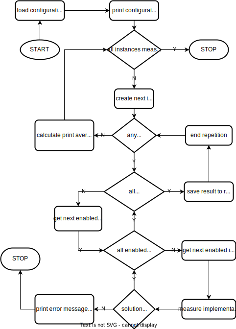
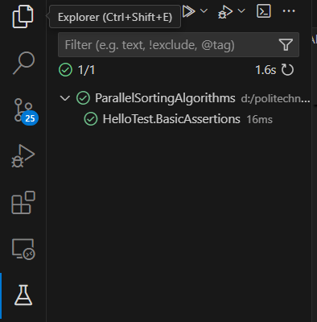
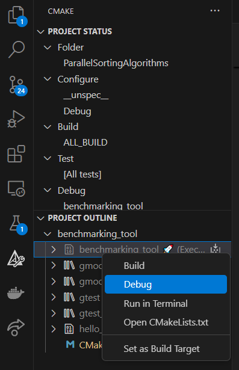

# ParallelSortingAlgorithms

- [ParallelSortingAlgorithms](#parallelsortingalgorithms)
  - [Benchmarking tool](#benchmarking-tool)
    - [Functionalities](#functionalities)
      - [Time measurement](#time-measurement)
      - [Saving results](#saving-results)
      - [Customizable configuration](#customizable-configuration)
      - [Verification of solutions](#verification-of-solutions)
    - [How to run benchmarking tool (Windows)?](#how-to-run-benchmarking-tool-windows)
  - [Developer's manual](#developers-manual)
    - [Sorting function convention](#sorting-function-convention)
    - [Benchmarking tool flowchart](#benchmarking-tool-flowchart)
    - [Directory structure](#directory-structure)
    - [Testing](#testing)
      - [Windows](#windows)
      - [VS Code](#vs-code)
    - [Debugging (in VS Code)](#debugging-in-vs-code)
  - [Graph-generating scripts](#graph-generating-scripts)
    - [Prerequisites](#prerequisites)
    - [Usage](#usage)
  - [Resources](#resources)

## Benchmarking tool

This project includes a source code for CLI benchmarking tool that allows you to measure time complexities of *Bitonic* and *Odd-Even* array sorting algorithms implemented for both CPU (plain *C++*) and GPU (*C++* & *CUDA*).

### Functionalities

#### Time measurement

Tool allows to measure time complexities for CPU and GPU implementations of *Bitonic* and *Odd-Even* array sorting algorithms. The measurement would be performed for different sizes of randomly-generated or predefined sorting problem instances. Each instance size would be measured multiple times in order to calculate an average result.

When measurement is done the average results and standard derivation for each instance size would be printed in following tabular format:

```
>>> STARTING BENCHMARK...

#=========================================#=========================#==========================#==========================#
| Instance size |       CPU Bitonic       |       GPU Bitonic       |       CPU Odd-Even       |       GPU Odd-Even       |
#=========================================#=========================#==========================#==========================#
|       1000000 | 1.23e+456 (1.23e+456) s | 1.23e+456 (1.23e+456) s |  1.23e+456 (1.23e+456) s |  1.23e+456 (1.23e+456) s |
|      10000000 | 1.23e+456 (1.23e+456) s | 1.23e+456 (1.23e+456) s |  1.23e+456 (1.23e+456) s |  1.23e+456 (1.23e+456) s |
|     100000000 | 1.23e+456 (1.23e+456) s | 1.23e+456 (1.23e+456) s |  1.23e+456 (1.23e+456) s |  1.23e+456 (1.23e+456) s |
|    1000000000 | 1.23e+456 (1.23e+456) s | 1.23e+456 (1.23e+456) s |  1.23e+456 (1.23e+456) s |  1.23e+456 (1.23e+456) s |
#=========================================#=========================#==========================#==========================#

>>> BENCHMARK COMPLETE!
```

#### Saving results

System saves measurement results for each repetition in an output file named `result.csv` located in tool's parent directory. Each line is associated with one repetition and contains following semicolon-separated (`;`) fields:

1. Instance size (integer number)
2. Execution time for *Bitonic Sort* implemented on CPU (real number with `.` decimal point or empty when measurement was disabled)
3. Execution time for *Bitonic Sort* implemented on GPU (real number with `.` decimal point or empty when measurement was disabled)
4. Execution time for *Odd-Even Sort* implemented on CPU (real number with `.` decimal point or empty when measurement was disabled)
5. Execution time for *Odd-Even Sort* implemented on GPU (real number with `.` decimal point or empty when measurement was disabled)

What's more the header would be also saved to the first line of `result.csv`.

#### Customizable configuration

Tool would allow user to specify custom configuration in the `configuration.ini` file. This file must be located in tool's parent directory. Each line of configuration file contains a key-value pairs with format `key=value`. All of the required keys are listed below:

- `measure_cpu`: Boolean value that defines if measurement for CPU implementations would be performed.
- `measure_gpu`: Boolean value that defines if measurement for GPU implementations would be performed.
- `measure_bitonic`: Boolean value that defines if measurement for *Bitonic Sort* would be performed.
- `measure_odd_even`: Boolean value that defines if measurement for *Odd-Even Sort* would be performed.
- `verify_result`: Boolean value that defines if sorting validity would be checked.

Other lines in this section may contain data for instances that should be measured. Each line contains a key-value pair where key is an `random_instance` or `predefined_instance` keyword. For `random_instance` key the value is a space-separated pair of instance size and number of measurement repetitions for it. For `predefined_instance` key the value is a number of repetitions for instance followed by the integers that are a part of instance itself (all space-separated).

The configuration file may also contain empty lines.

Example of a valid configuration file is shown below:

```ini
measure_cpu=0
measure_gpu=1
measure_bitonic=1
measure_odd_even=1
verify_result=1

random_instance=50000 10
random_instance=10000000 56
random_instance=199 56

predefined_instance=4 -1 88 2 9 4 105 1 34
```

Tool would print current configuration during startup. Example of such print for previously presented configuration file is shown below:

```
>>> CONFIGURATION LOADED

CPU measurement                 OFF
GPU measurement                 ON
Bitonic Sort measurement        ON
Odd-Even Sort measurement       ON
Results verification            ON

Defined instances               4

```

#### Verification of solutions

For each repetition solutions from all of the implementations are verified. If implementation sorted instance properly then nothing special happens. Otherwise the tool would be terminated and information about an error would be printed to console (example below).

```
>>> STARTING BENCHMARK...

#=========================================#=========================#==========================#==========================#
| Instance size |       CPU Bitonic       |       GPU Bitonic       |       CPU Odd-Even       |       GPU Odd-Even       |
#=========================================#=========================#==========================#==========================#
|       1000000 | 1.23e+456 (1.23e+456) s | 1.23e+456 (1.23e+456) s |  1.23e+456 (1.23e+456) s |  1.23e+456 (1.23e+456) s |

>>> BENCHMARK TERMINATED!
>>> The GPU Odd-Even has given an invalid solution for instance size 100000 in repetition 4.
>>> Please check the "error.log" file.
```

Details about an error would be saved to the `error.log` file that would be located in the tool's parent directory. This details are:

- Error message from console.
- List of space-separated integers that are part of problematic instance.
- Invalidly sorted instance in a form of space-separated integers that are a part of problematic instance.

Example of `error.log` content is shown below:

```
>>> The GPU Odd-Even has given an invalid solution for instance size 10  in repetition 4.
[Instance]: 0 5 8 1 3 5 8
[Solution]: 0 1 3 8 5 8 5
```

### How to run benchmarking tool (Windows)?

In order to run benchmarking tool you need to first build it from the source files. The *CMake* tool is recommended an easiest way to do this since you only have to run te `build.bat` script (see command below).

```cmd
.\scripts\build.bat
```

When the build is finished both `benchmarking_tool.exe` and `debug_benchmarking_tool.exe` files would appear in the project's main directory. The `benchmarking_tool.exe` is the *release* build and the `debug_benchmarking_tool.exe` is the *debug* build. For the measurement purposes you should really use only the *release* build since it's optimized. You can run benchmarking tool with the following command:

```cmd
.\benchmarking_tool.exe
```

## Developer's manual

### Sorting function convention

Each sorting algorithm implementation should be put inside a `<architecture><algorithm>Sort()` function, where `<implementation>` is a placeholder for achitecture (CPU/GPU) name and `<algorithm>` is a placeholder for algorithm (*Bitonic*/*Odd-Even*) name. Function's name should be written in camel case. Example of valid function's header is shown below.

```cpp
void GpuBitonicSort(std::vector<int>& array);
```

It should take an array that would be sorted. Sorted array would be placed into the same memory location as the original array.

### Benchmarking tool flowchart



### Directory structure

- `gfx`: All graphics used in the repo.
- `benchmarking_tool`: source codes and headers of the benchmarking tools
    - `headers`: headers for benchmarking tools source code
    - `src`: source files for benchmarking tools source code
- `tests`: folder for unit and integration tests
- `scripts`: utility scripts for building and testing of the benchmarking tool as well as some scripts that would help to prepare graphs
- `results`: saved `*.csv` files with benchmarking results

### Testing

All tests should be placed in the `test` directory. The testing tool for the project is the *Google Test* library.

#### Windows

In order to run test regression you need to use the `test.bat` scrip. Please take note that it requires *CMake* to be installed on your system. This script would build the tool and then run the *Google Test* regression.

```cmd
.\scripts\test.bat
```

#### VS Code

In order to run tests in the *VS Code* you need to install both *CMake* and extensions such as *CMake Extension*, *CMake Tools Extension* and *CMake Language Support Extension*. This would add the *Testing* tab to your IDE where you can run tests.

> ⚠️ Remember that you need to refresh the tab first in order to build tests' code! Only after that you can actually run the regression.



### Debugging (in VS Code)

In order to debug the tool with *VS Code* you need to install both *CMake* and extensions such as *CMake Extension*, *CMake Tools Extension* and *CMake Language Support Extension*. This would add another tab to your IDE called *CMake*, where you can run the debugger with appropriate context menu (see figure below).



## Graph-generating scripts

### Prerequisites

In order to use graph-generating scripts you need to create a *Python 3.12* virtual environment.

```bash
python3 -m venv .venv
```

Then you need to activate this environment and install all required dependencies from the `requirements.txt`.

For *linux*:

```bash
source .venv/bin/acivate
```

```bash
pip install -r requirements.txt
```

For *Windows*:

```cmd
.\.venv\Scripts\activate.bat
```

```bash
pip install -r requirements.txt
```

### Usage

The tool comes with a handful of *Python 3.12* scripts that allow to generate various graph for:

- Comparison of all implementations (based on one `result.csv` file).

  ```bash
  python3 scripts/graph_generators/compare_all_implementations.py PATH_TO_RESULTS_FILE
  ```

- Comparison of two benchmarks for one of implementations (based on two `result.csv` files).

  ```bash
  python3 scripts/graph_generators/compare_one_implementation.py PATH_TO_RESULTS_FILE
  ```

- Comparison of CPU and GPU implementations for one algorithm (based on one `results.csv` file).

  ```bash
  python3 scripts/graph_generators/compare_cpu_gpu_for_algorithm.py PATH_TO_RESULTS_FILE
  ```

- Presentation of time complexity for one of implementations (based on one `results.csv` file).

  ```bash
  python3 scripts/graph_generators/implementation_time_complexity.py PATH_TO_RESULTS_FILE
  ```

All of those scripts present an appropriate graph and saves it to a PDF file to the `gfx/plots/` directory.

## Resources

- [Project's board on Trello](https://trello.com/b/PZKg8jf4/gpuwt0910zrownoleglonealgorytmysortowania)
- [Documentation on _Overleaf_](https://www.overleaf.com/project/67269f0e5f7564bafb402362)
